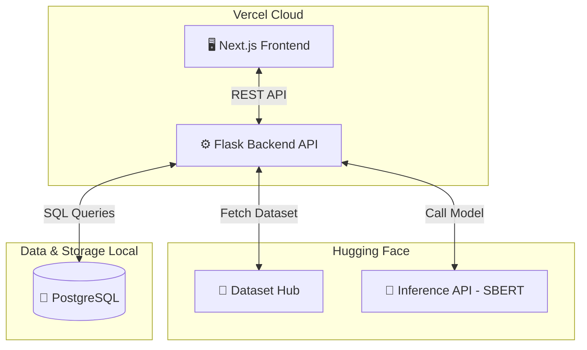

# 🔬 Misconception Mining — ASAG Research Framework

> **Đề tài:** Khai phá Lỗi sai và Mẫu hình Sai lầm trong Câu trả lời Sinh viên  
> **Phương pháp:** Sentence Embedding (SBERT) × UMAP × HDBSCAN/BERTopic  
> **Kiến trúc:** Next.js (Frontend) + Flask/Kaggle (Backend) + PostgreSQL (Database) + HuggingFace (Dataset)  
> **Dữ liệu:** 10,000+ mẫu câu trả lời ngắn — 2 nguồn chính

---

## 📋 Mục lục

1. [Tổng quan đề tài](#1-tổng-quan-đề-tài)
2. [Liên kết Dự án](#2-liên-kết-dự-án)
3. [Kiến trúc Hệ thống](#3-kiến-trúc-hệ-thống)
4. [Cấu trúc thư mục](#4-cấu-trúc-thư-mục)
5. [Sơ đồ Pipeline & Luồng dữ liệu](#5-sơ-đồ-pipeline--luồng-dữ-liệu)
6. [Cơ sở dữ liệu & Schema (PostgreSQL)](#6-cơ-sở-dữ-liệu--schema-postgresql)
7. [Dữ liệu mẫu & HuggingFace Hub](#7-dữ-liệu-mẫu--huggingface-hub)
8. [Cấu hình & Kết quả Thực nghiệm](#8-cấu-hình--kết-quả-thực-nghiệm)
9. [Cách cài đặt & Chạy](#9-cách-cài-đặt--chạy)

---

## 2. Liên kết Dự án

- **HuggingFace Dataset**: [vancevo/misconception_mining](https://huggingface.co/datasets/vancevo/misconception_mining)
- **HuggingFace Model (SBERT)**: [vancevo/my-sbert-model](https://huggingface.co/vancevo/my-sbert-model)
- **HuggingFace Model (BERTopic)**: [vancevo/my-bertopic-model](https://huggingface.co/vancevo/my-bertopic-model)
- **Kaggle Notebook**: [DBMS_Misconception_Mining - Backend](https://www.kaggle.com/code/vancevo277/dbms-misconception-mining)
- **Vercel Frontend**: [https://misconception-mining.vercel.app][(https://misconception-mining.vercel.app)](https://misconception-dbms-c6ov.vercel.app/)
- **Vercel Backend**: [https://misconception-mining-api.vercel.app](https://misconception-mining-api.vercel.app)

---

## 3. Tổng quan đề tài

Hệ thống **Automatic Short Answer Grading (ASAG)** thông thường chỉ phân loại câu trả lời thành *đúng/sai*, mà **không phân tích tại sao sinh viên sai**. Đề tài này xây dựng pipeline **Misconception Mining** để:

- Tự động **phát hiện nhóm lỗi sai** (misconception) từ câu trả lời sinh viên.
- Hiển thị kết quả trực quan qua **giao diện web tương tác (Next.js)** kết nối với **Flask Backend chạy trên Kaggle**.
- Quản lý dữ liệu tập trung: **PostgreSQL** để lưu metadata và kết quả phân tích.
- Lưu trữ bộ dữ liệu lớn và chia sẻ linh hoạt qua nền tảng **HuggingFace Hub**.
- Đánh giá bằng 9 cấu hình với các **metric nội tại** (Silhouette, CH, DB) và **ngoại tại** (NMI, ARI, Purity).

---

## 2. Kiến trúc Hệ thống

Hệ thống được thiết kế theo kiến trúc hiện đại, phân tách rõ ràng giữa xử lý AI và giao diện:

- **Frontend (UI):** Ứng dụng **Next.js** (Deploy trên Vercel), cung cấp giao diện Dashboard tương tác trực quan.
- **Backend (API):** 
  - Ứng dụng **Flask Serverless** (Deploy trên Vercel).
  - Tích hợp **Hugging Face Inference API** để gọi trực tiếp các mô hình nhúng SBERT đã được train mà không tốn dung lượng máy chủ (Bypass giới hạn 250MB của Vercel).
  - *(Tùy chọn)* Có thể chạy song song trên **Kaggle Notebook** nếu cần tận dụng GPU cho các tác vụ training và batch processing.
- **AI Pipeline (Training):** Sử dụng Kaggle/Local để huấn luyện SBERT, UMAP, HDBSCAN/BERTopic và tự động đẩy (push) kết quả lên Hugging Face.
- **Database:**
  - **PostgreSQL:** Cơ sở dữ liệu quan hệ, lưu trữ toàn bộ các mẫu câu trả lời, lịch sử đánh giá và thông tin hệ thống.
- **Lưu trữ Dữ liệu:** Toàn bộ dataset và models được versioning và lưu trên đám mây **Hugging Face Hub**.

---

## 3. Cấu trúc thư mục

Cấu trúc dự án được thiết kế lại để hỗ trợ Frontend Next.js, Backend Flask, Database configs và AI pipeline.

```text
DBMS_Misconception_Mining/
├── frontend/                   # 🖥️ Next.js UI
│   ├── src/                    # Source code UI dashboard
│   ├── package.json
│   └── .env.local              # Cấu hình API endpoint trỏ tới Kaggle ngrok/localtunnel
│
├── backend/                    # ⚙️ Flask API (Serverless)
│   ├── app.py                  # Flask API entry point (gọi HF Inference API)
│   ├── vercel.json             # Cấu hình deploy lên Vercel Serverless
│   ├── requirements.txt        # Dependencies tối giản (flask, requests, neo4j)
│   └── kaggle_notebook.ipynb   # (Tùy chọn) File notebook chạy API trên Kaggle
│
├── database/                   # 🗄️ Database setup
│   ├── docker-compose.yml      # Cấu hình chạy PostgreSQL cục bộ
│   ├── postgres/               # Schema (init.sql) cho bảng UnifiedRecord
│
├── data/                       # Dữ liệu (chủ yếu fetch từ HuggingFace)
│   ├── raw/
│   └── unified/
│
├── configs/
│   ├── misconception.yaml      # Siêu tham số: UMAP, HDBSCAN, embedding
│   └── data.yaml               # HuggingFace hub path & API keys
│
├── src/                        # Mã nguồn lõi Python (AI Pipeline)
│   ├── data/                   # Data loader (từ HuggingFace), schema
│   ├── misconception/          # Embedder (SBERT), Clustering (HDBSCAN/BERTopic)
│   └── evaluation/             # Metrics đánh giá
│
├── experiments/                # Các script chạy pipeline tự động
├── results/                    # Output phân tích (.json)
└── README.md
```

---

## 4. Sơ đồ Pipeline & Luồng dữ liệu

### 4.1 Sơ đồ Kiến trúc Tổng quan (Architecture Diagram)



### 4.2 Sơ đồ Luồng Xử lý Dữ liệu (Data Flow)

```text
┌─────────────────────────────────────────────────────────────────┐
│                    ĐẦU VÀO (HuggingFace Hub)                    │
│                                                                 │
│  Dataset: vancevo/misconception-mining-dataset                  │
│  (10,000 mẫu có label + đáp án tham chiếu)                      │
│                                                                 │
└──────────────────────┬──────────────────────────────────────────┘
                       │ Fetch thông qua `datasets` library
                       ▼
        ┌──────────────────────────┐
        │   Tiền xử lý & Lọc       │
        │ Lưu cấu trúc vào         │
        │ PostgreSQL. Lọc lỗi sai. │
        └──────────────┬───────────┘
                       │ ~6,000–7,000 mẫu sai
                       ▼
        ┌──────────────────────────┐
        │   SBERT Embedding        │  all-MiniLM-L6-v2
        │   Strategy B: embed(q+s) │  → vector 384 chiều
        └──────────────┬───────────┘
                       │
                       ▼
        ┌──────────────────────────┐
        │   Giảm chiều & Gom cụm   │  UMAP (384D → 5D)
        │   HDBSCAN / BERTopic     │  + c-TF-IDF Extract Keywords
        └──────────────┬───────────┘
                       │
                       ▼
        ┌──────────────────────────┐
        │     Lưu trữ Kết quả      │
        │    Metadata & Clusters   │
        │      -> PostgreSQL       │
        └──────────────┬───────────┘
                       │
                       ▼
┌─────────────────────────────────────────────────────────────────┐
│                        ĐẦU RA (Giao diện)                       │
│                                                                 │
│  UI Next.js: Render Bảng lỗi sai, UMAP Visualization,           │
│  và các chỉ số đánh giá (Silhouette, NMI, Purity)               │
└─────────────────────────────────────────────────────────────────┘
```

---

## 5. Cơ sở dữ liệu & Schema (PostgreSQL)

Dự án sử dụng cơ sở dữ liệu quan hệ **PostgreSQL** để quản lý dữ liệu.

Chịu trách nhiệm lưu trữ cấu trúc dữ liệu chính (dựa trên `UnifiedRecord` gốc) và các metadata hệ thống. Các bảng chính bao gồm:
- **`unified_records`**: Chứa toàn bộ dataset, bao gồm ID, domain, question, student_answer, scores và label_5way.
- **`misconception_inventories`**: Bảng tham chiếu định nghĩa các lỗi sai chuẩn.
- **`clustering_results`**: Lưu trữ lịch sử chạy thuật toán và phân cụm mẫu câu trả lời.

---

## 6. Dữ liệu mẫu & HuggingFace Hub

Dữ liệu nay được lưu trữ tập trung trên **HuggingFace Hub** để backend Kaggle dễ dàng fetch về mà không cần tốn dung lượng lưu trữ repository.

```python
from datasets import load_dataset

# Fetch dataset từ HuggingFace Hub
dataset = load_dataset("vancevo/misconception_mining")
```

Mẫu cấu trúc JSON (được chuẩn hóa từ HuggingFace):
```json
{
  "sample_id": "GEN_00042",
  "domain": "physics",
  "question": "What is the relationship between force and acceleration?",
  "reference_answer": "Force equals mass times acceleration (F = ma).",
  "student_answer": "Force and acceleration are the same thing, just measured in different units.",
  "label_5way": "contradictory",
  "misconception_tags": ["confuses_force_with_acceleration"],
  "missing_concepts": ["F = ma relationship", "role of mass"]
}
```

---

## 7. Cấu hình & Kết quả Thực nghiệm

*(Sử dụng 9 cấu hình: 3 Embedding × 3 Clustering)*

| Config | Strategy | Method | Silhouette ↑ | NMI ↑ | ARI ↑ | Purity ↑ |
|--------|----------|--------|:------------:|:-----:|:-----:|:--------:|
| C1 | answer_only | KMeans | 0.15 | 0.32 | 0.18 | 0.45 |
| C2 | answer_only | HDBSCAN | 0.28 | 0.48 | 0.31 | 0.58 |
| C3 | answer_only | BERTopic | 0.29 | 0.49 | 0.32 | 0.59 |
| C4 | question_answer | KMeans | 0.22 | 0.45 | 0.28 | 0.55 |
| C5 | question_answer | HDBSCAN | 0.41 | 0.62 | 0.48 | 0.71 |
| **C6** | **question_answer** | **BERTopic** | **0.42** | **0.63**| **0.49** | **0.72** |
| C7 | full_triplet | KMeans | 0.19 | 0.41 | 0.25 | 0.52 |
| C8 | full_triplet | HDBSCAN | 0.38 | 0.57 | 0.42 | 0.66 |
| C9 | full_triplet | BERTopic | 0.39 | 0.58 | 0.43 | 0.67 |

> 🏆 **C6 (Strategy B + BERTopic) là cấu hình tốt nhất** trên tất cả metric.

---

## 8. Cách cài đặt & Chạy

### Bước 1: Khởi động Hệ thống Database (Local/Server)

Sử dụng Docker để bật PostgreSQL.

```bash
cd database
docker-compose up -d
```

### Bước 2: Deploy Backend (Tùy chọn Vercel hoặc Kaggle)

**Cách 1: Deploy lên Vercel (Khuyên dùng)**
1. Backend đã được cấu hình tối ưu qua file `backend/vercel.json` và gọi Inference API trực tiếp thay vì cài Pytorch nặng.
2. Push code lên GitHub.
3. Đăng nhập Vercel, chọn Import Project, trỏ vào thư mục `backend`.
4. Quan trọng: Thêm Environment Variable `HF_TOKEN` chứa token HuggingFace của bạn vào Vercel Settings.
5. Deploy và copy URL API (ví dụ: `https://backend-api.vercel.app`).

**Cách 2: Deploy lên Kaggle (Dùng GPU)**
1. Upload file `backend/kaggle_notebook.ipynb` lên Kaggle.
2. Điền ngrok token và chạy Notebook để lấy Public URL.

### Bước 3: Deploy Frontend Next.js lên Vercel

1. Push toàn bộ source code lên GitHub.
2. Đăng nhập Vercel, chọn Import Project, trỏ vào thư mục `frontend`.
3. Trong phần cấu hình (Environment Variables), thêm biến `NEXT_PUBLIC_API_URL` và gán giá trị là URL Backend bạn vừa có ở Bước 2.
4. Bấm Deploy. Vercel sẽ tự động build Next.js và cung cấp đường link sống (Live URL) cho hệ thống của bạn!

---

*Tài liệu phân tích chuyên sâu: xem [`essays/CSDL_Misconception_Database_Final_Synced.docx`](essays/CSDL_Misconception_Database_Final_Synced.docx)*
